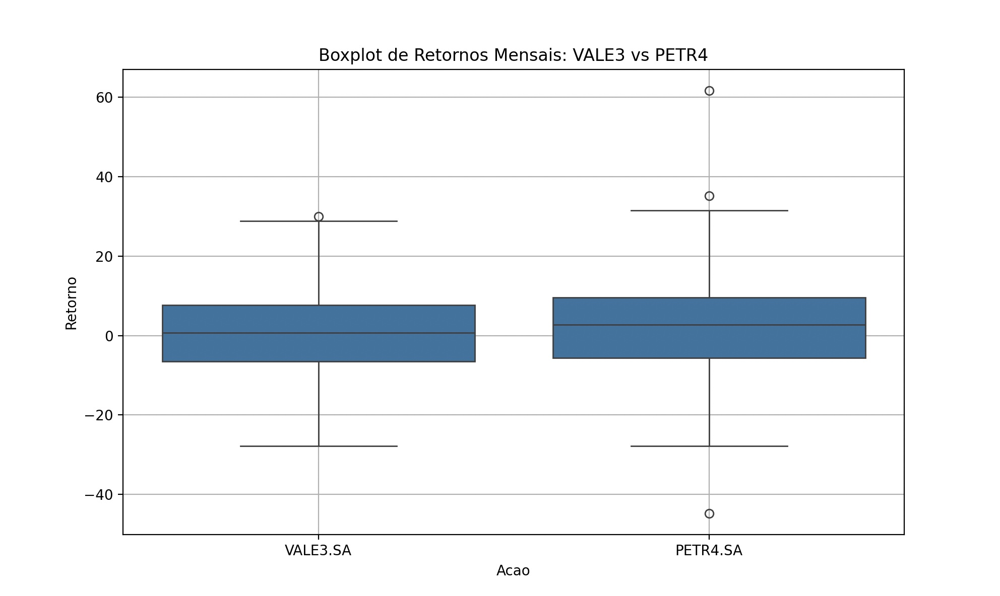
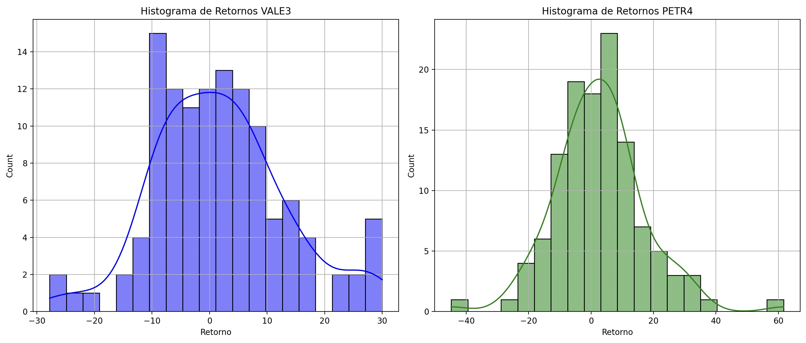
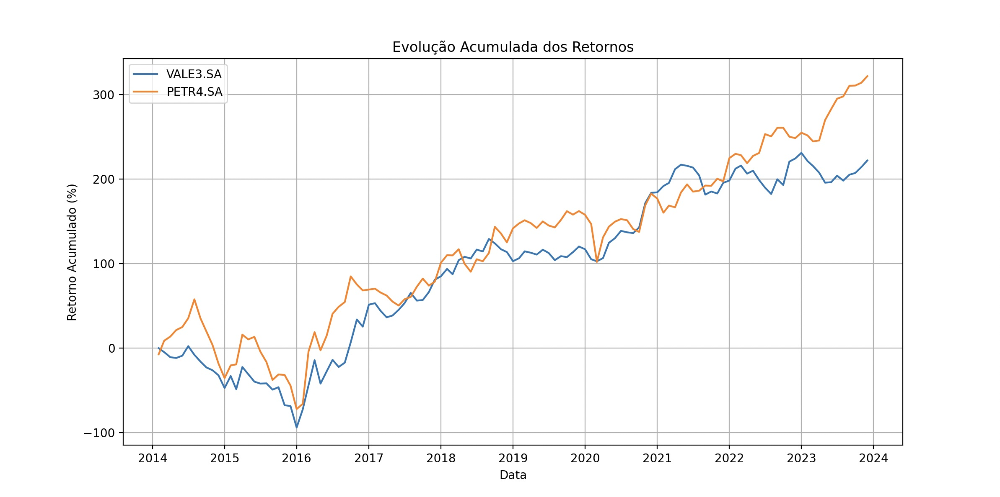
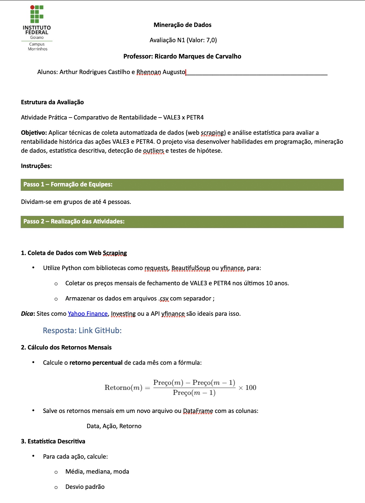
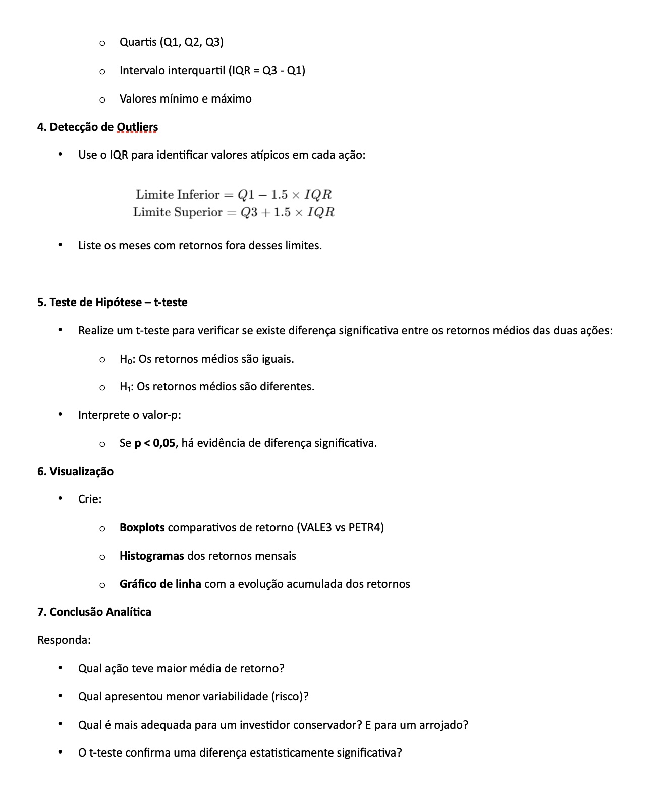
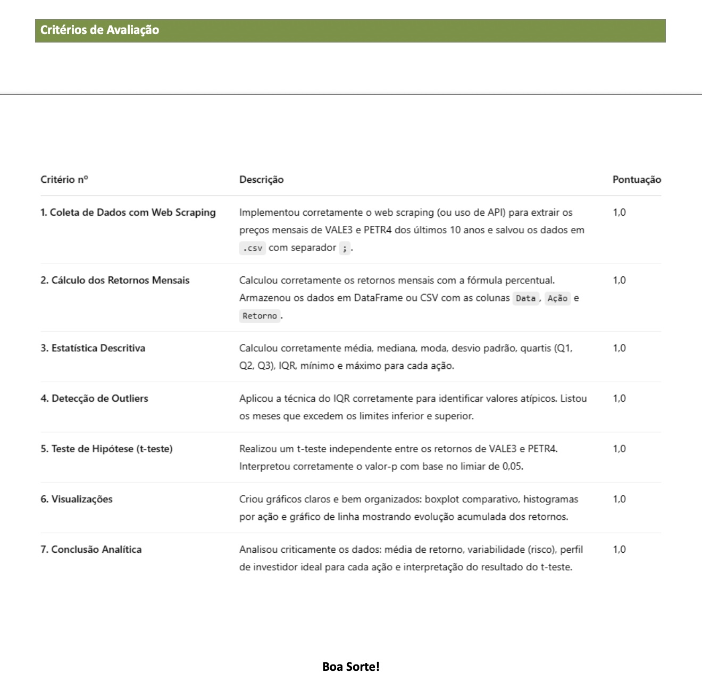

# Avaliação 01 - N1

# Alunos
- [Arthur Rodrigues](https://github.com/ArthurRCastilho)
- [Rhennan Augusto Santana do Carmo](https://github.com/RhennanAugusto)

## Retorno
- [n1_avaliacao.py](https://github.com/ArthurRCastilho/MineracaoDados/blob/main/N1/n1_avaliacao.py)  

1. Coletando dados históricos de VALE3 e PETR4... 
YF.download() has changed argument auto_adjust default to True 
[*********************100%***********************]  1 of 1 completed 
[*********************100%***********************]  1 of 1 completed 
Dados coletados e salvos. 

2. Calculando retornos mensais... 
Retornos calculados e salvos. 

3. Calculando estatísticas descritivas... 
             media   mediana       moda  desvio_padrao        Q1        Q2        Q3     minimo     maximo        IQR 
VALE3.SA  1.863866  0.721682 -27.780597      11.424122 -6.559879  0.721682  7.726991 -27.780597  29.966988  14.286869 
PETR4.SA  2.702020  2.708787 -44.790834      14.359424 -5.638865  2.708787  9.567598 -44.790834  61.673077  15.206463 

4. Detectando outliers usando o IQR... 

Outliers detectados para VALE3.SA: 
         Data    Retorno 
27 2016-04-01  29.966988 

Outliers detectados para PETR4.SA: 
         Data    Retorno 
15 2015-04-01  35.196686 
26 2016-03-01  61.673077 
74 2020-03-01 -44.790834 

5. Realizando t-teste de independência entre retornos de VALE3 e PETR4... 
Valor de p: 0.61877 
Resultado: Não existe diferença significativa entre os retornos médios. 

6. Gerando visualizações... 

Conclusão Analítica: 

- Retorno Médio: 
VALE3 teve um retorno médio de 1.86% ao mês. 
PETR4 teve um retorno médio de 2.70% ao mês. 
PETR4 apresentou um retorno médio superior a VALE3. 

- Risco (Variabilidade dos Retornos): 
Desvio padrão dos retornos de VALE3: 11.42 
Desvio padrão dos retornos de PETR4: 14.36 
PETR4 apresentou maior volatilidade (risco) em relação a VALE3. 

- Perfil de Investidor Ideal: 
Ambas as ações apresentam características distintas. VALE3 ou PETR4 podem ser escolhidas conforme o apetite ao risco do investidor. 

- Teste de Hipótese (Comparação de Retornos Médios): 
O teste de hipótese indicou que não existe diferença estatisticamente significativa entre os retornos médios de VALE3 e PETR4. 

Análise concluída. 

## Gráficos

## Avaliação

